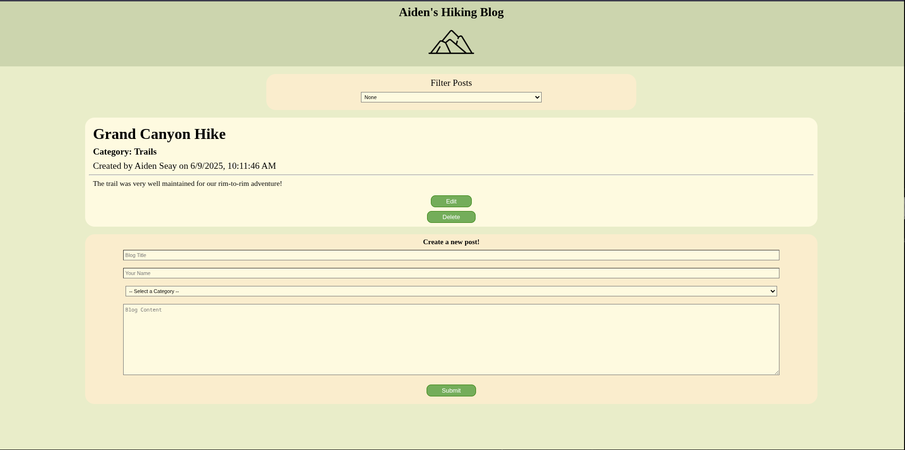
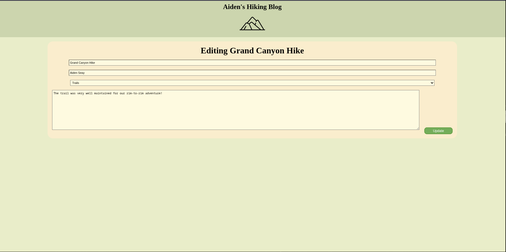

# CS-312-MiniProject-1

### Overview

Basic Blog Web Application using NodeJS, ExpressJS, and EJS.

#### Capabilities
- Create posts and dynamically display them on the home page.
- Ability to delete and edit each post.
- Filter posts by their category.

#### Limitations
- No accounts or user verification.
- No database for persistence between sessions.

### Preview

<em>Homepage</em>

 

<em>Editing Page</em>

### Sources
- [w3schools: For general documentation (JS, HTML, CSS)](https://www.w3schools.com/)
- [Stack Overflow: HTML select option with EJS](https://stackoverflow.com/questions/34878180/html-select-option-with-ejs/51072916)
- [Stack Overflow: Auto submit dropdown when value selected](https://stackoverflow.com/questions/19086737/how-do-i-auto-submit-a-dropdown-when-a-value-is-selected-other-than-the-first-va)
- [Stack Overflow: Default select option disabled](https://stackoverflow.com/questions/22033922/how-to-show-disabled-html-select-option-by-default)
- [Button Generator from Udemy demo](https://www.bestcssbuttongenerator.com/)
- <a href="https://www.flaticon.com/free-icons/mountain" title="mountain icons">Mountain icon created by Freepik - Flaticon</a>